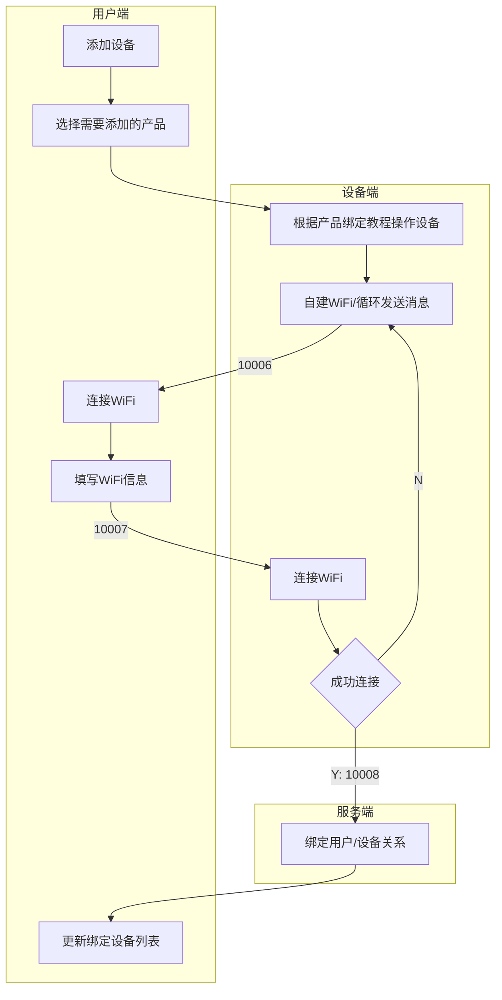

# nebula-iot-helper

> 使用 Vue + Electron 实现的物联网设备调试助手  
> A debugging assistant for IoT devices using Vue + Electron  

## 实现流程
> [最新实现流程地址](https://www.processon.com/view/link/5f3e8a635653bb06f2dd9fb8)



## 指令代码

```json
{
  "10001": "请求 Token",
  "10002": "返回 Token",
  "10003": "开机",
  "10004": "重启",
  "10005": "关机",
  "10006": "请求 WiFi 信息/接收到请求返回",
  "10007": "返回 WiFi 信息",
  "10008": "绑定设备"
}
```

