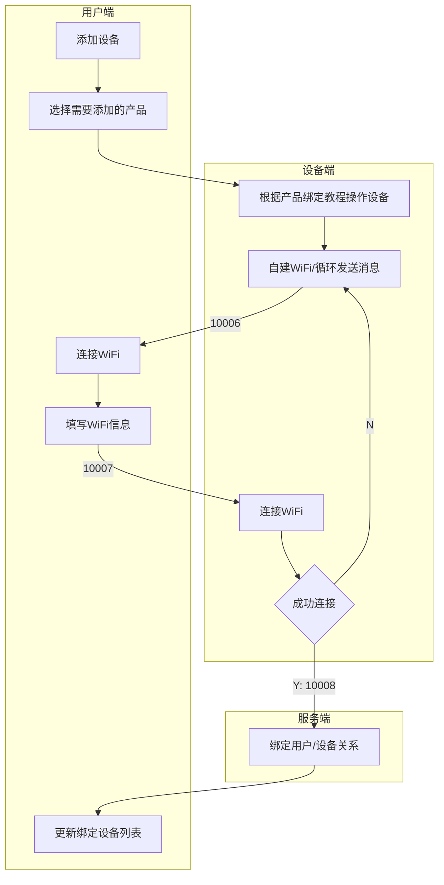

# nebula-iot-helper

> 使用 Vue + Electron 实现的物联网设备调试助手  
> A debugging assistant for IoT devices using Vue + Electron  

## 实现流程
> [最新实现流程地址](https://www.processon.com/view/link/5f3e8a635653bb06f2dd9fb8)



## 指令代码

```json
{
  "10001": "请求 Token",
  "10002": "返回 Token",
  "10003": "开机",
  "10004": "重启",
  "10005": "关机",
  "10006": "请求 WiFi 信息/接收到请求返回",
  "10007": "返回 WiFi 信息",
  "10008": "绑定设备"
}
```

## 通讯示例

### 请求 Token

```json
{
  "length": "11",
  "token": "",
  "code": "10001",
  "data": {
    "uuid": "产品/用户编号",
    "ip": "服务器/路由器IP",
    "port": "本机端口"
  },
  "message": "",
  "crc": "D43D"
}
```

### 返回 Token

```json
{
  "length": "11",
  "token": "",
  "code": "10002",
  "data": {
    "ip": "服务器/路由器IP",
    "port": "本机端口",
    "token": ""
  },
  "message": "",
  "crc": "D43D"
}
```

### 开机

```json
{
  "length": "11",
  "token": "",
  "code": "10003",
  "data": {
    "ip": "服务器/路由器IP",
    "port": "本机端口"
  },
  "message": "",
  "crc": "D43D"
}
```

### 重启

```json
{
  "length": "11",
  "token": "",
  "code": "10004",
  "data": {
    "ip": "服务器/路由器IP",
    "port": "本机端口"
  },
  "message": "",
  "crc": "D43D"
}
```

### 关机

```json
{
  "length": "11",
  "token": "",
  "code": "10005",
  "data": {
    "ip": "服务器/路由器IP",
    "port": "本机端口"
  },
  "message": "",
  "crc": "D43D"
}
```

### 请求 WiFi 信息/接收到请求返回

```json
{
  "length": "11",
  "token": "",
  "code": "10006",
  "data": {
    "uuid": "产品/用户编号",
    "ip": "服务器/路由器IP",
    "port": "本机端口"
  },
  "message": "",
  "crc": "D43D"
}
```

### 返回 WiFi 信息

```json
{
  "length": "11",
  "token": "",
  "code": "10007",
  "data": {
    "wifi": "WiFi名称",
    "pwd": "WiFi密码",
    "uuid": "产品/用户编号",
    "ip": "服务器/路由器IP",
    "port": "本机端口"
  },
  "message": "",
  "crc": "D43D"
}
```

### 绑定设备

```json
{
  "length": "11",
  "token": "",
  "code": "10008",
  "data": {
    "userid": "用户编号",
    "uuid": "产品编号"
  },
  "message": "",
  "crc": "D43D"
}
```
